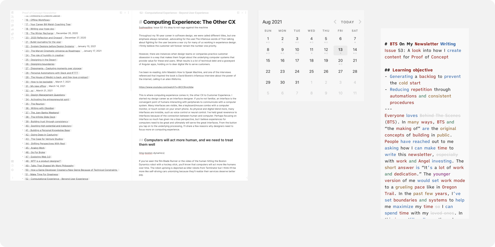
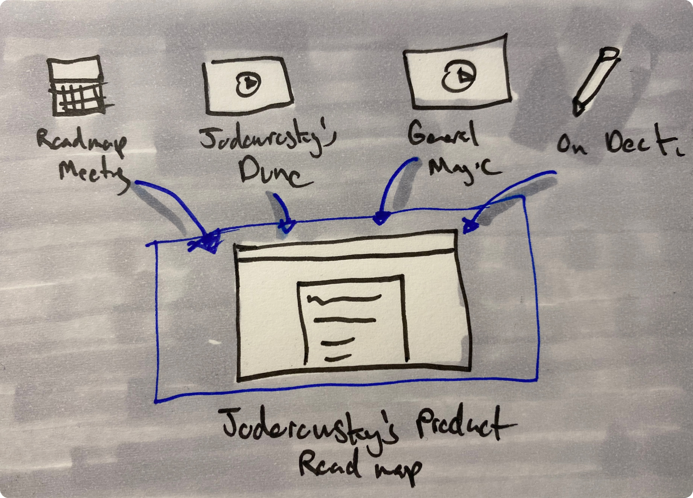
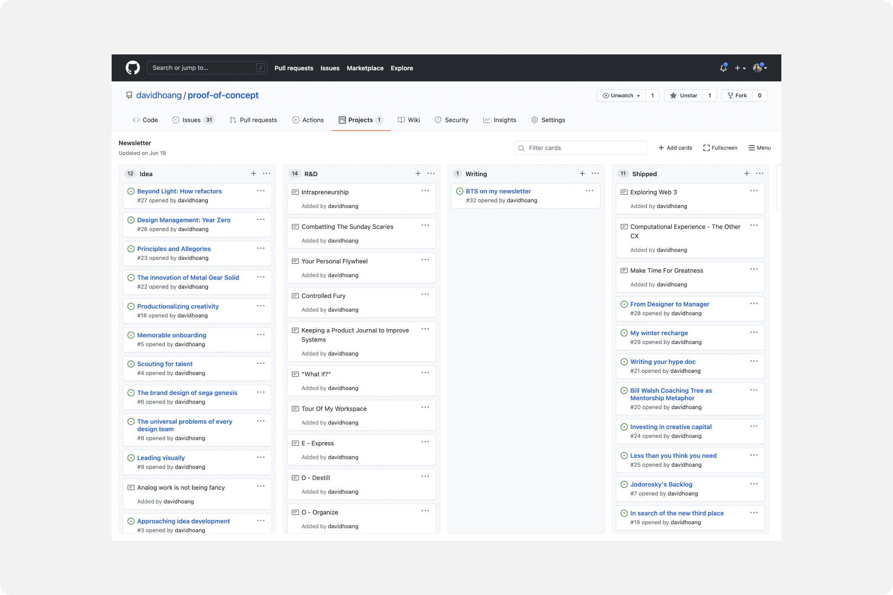
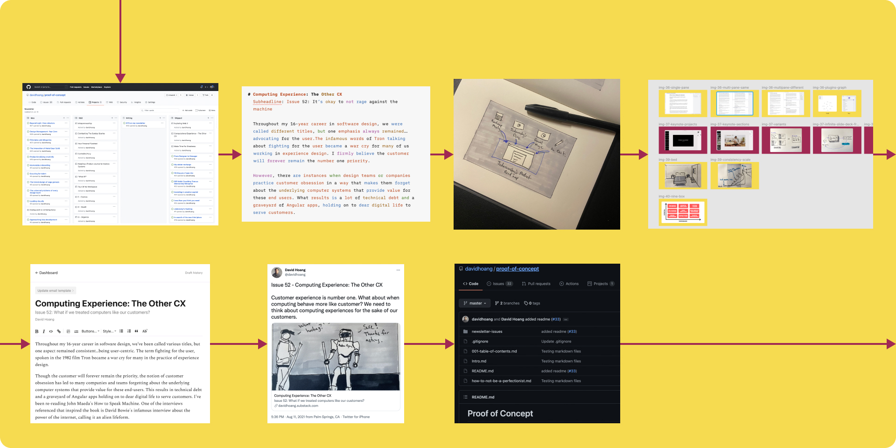

# 0053 - BTS On My Newsletter Writing

# How I Make Content For This Newsletter
Issue 53: BTS on the making of Proof of Concept

## Learning objective
- Generating a backlog to prevent the cold start
- Reducing repetition through automations and consistent procedures
---
People have reached out to me asking how I can make time to write this newsletter, especially with work and Angel investing. The short answer is “It’s a lot of work and dedication.” The younger version of me would set work mode to a grueling pace like in Oregon Trail. In the past few years, I’ve set boundaries and systems to help me maximize my time so I can spend time with my loved ones. Everyone loves some BTS (Behind The Scenes) so let’s get to it.

## My Approach

My goal is to help people maximize their creativity and this is why I spend my personal time writing this newsletter. Since this is a passion project, I force myself to be rigorous about the time committed to writing; finding all the edges of time to create a publication. In the beginning, every newsletter issue was written hours before I would send it. Along the way, I learned best practices and ways to optimize ideas and maximize my time.

### Start unstructured and make it easy to write anywhere

I used to glamorize writing as sitting at my desk for hours and type the next great American novel. For me, the reality is stitching blocks of time throughout many days to write. First drafts should be sloppy and ideation are even messier. 

My best thoughts often come up when I'm not at my desk: going on a walk, sitting on the couch, or even in the shower. My mind is constantly racing with ideas which makes it crucial to write down thoughts regardless of fidelity. This might be an idea for something to explore, a sentence I think that is memorable, or a list of words I'd like to use more (don't be surprised when "amalgam" drops in a newsletter). 

Make sure writing is accessible on every device I use. I set the writing app to be the first thing that launches and what I see. Instead of opening Twitter (oh, I'll open it later), my writing app is in front of my face, forcing me to jot a few thoughts. There are some days where I get more writing done on my phone while waiting in lines than sitting at my desk for hours. When I wake up, there is a notebook bedside and post-it notes everywhere around the house. Put words everywhere.

The second recommendation is to write daily. Whether you prefer writing on paper or using an app, take daily notes and review them frequently. A single thought might be a boring idea, but the amalgam of concepts makes interesting narratives. There was a week where a product roadmap meeting and watching a documentary inspired me to write [Jodorowsky's Product Roadmap](https://www.davidhoang.com/blog/jodorowskys-product-roadmap)—an essay about the parallels between having a great vision and a roadmap. Combined ideas from daily notes can lead to interesting paths.

### Iterate through the writing cycle

[Brie Wolfson](https://twitter.com/zebriez) gave me one of the best pieces of advice when it came to writing: make reading, writing, and editing as accessible as possible.

I typically write on my desktop computer. Since the majority of readers likely are on their mobile devices, I read and edit articles on my phone to simulate the reading experience.

### Reduce repetition and automate
I noticed repetitions that occur in my workflow after writing more than 50 newsletter issues. As I refine my writing and content, many opportunities to automate and make writing more efficient surface:

- Created a template markdown file so I can write immediately
- Use a Figma project to store all assets to create visuals
- Making sketches have a more unified and consistent style

### Make a writing roadmap
Plans change and so does your mood. What you were excited to write about a few days ago may not be as motivating later. I have a GitHub project that roadmaps all my ideas that I can move around. The benefit of a roadmap is since I’m constantly capturing ideas, all of these topics have fragments of writing I can build momentum to avoid the cold start problem.

## The workflow itself
My strength is being a lateral thinker, so there’s never a linear path. This is my best attempt at creating a sequential workflow for those who are linear thinkers.

## 1. Review backlog
Like any good agile sprint, start with reviewing the backlog. If I don’t have an idea to write for the week, this backlog helps me pick something. I also can use the backlog to get ahead on structuring future issues.

### 2. Draft in iA Writer
If you’ve subscribed for a while, you know I love Obsidian MD. When it comes to focused writing I use iA Writer to capture thoughts. I’ve considered writing directly in the browser but love the focus of an app to avoid the temptation of surfing the web. Deep focus is key at this stage.

### 3. Sketch out visuals

While writing, I’ll keep in mind concepts that would benefit from having a visual aid. I first tried making visuals in Procreate, but couldn’t find a visual language that felt like my style. While working on ink sketches to prep for digital creation, I realized the sketches felt more like me and have continued embracing it.

### 4. Create assets in Figma
I have a Figma file where all my creative assets are stored, including cover images, assets, and the sketch visuals I created. It’s helpful to have it in one file to create color swatches and styles to easily export assets.

### 5. Edit in Substack then schedule

Once the writing and images are ready, I’ll copy/paste it into Substack’s WYSIWYG editor. It requires minimal re-formatting so I’m okay with this workflow. I’ll send a few drafts to friends to review, and if it looks good, I schedule it for Sunday morning. The next two steps are after publishing.

### 6. Share on Twitter
I’ll post the issue on Twitter a few days after. I want to make sure subscribers have earlier access. 

### 7. Update in GitHub repository
This is a new step. I’ll update the articles in the GitHub repository, and groom the backlog to add new ideas or prioritize what I’ll write next. 

Hope this was helpful! If you write a newsletter I’d love some of your ideas. 

## Keep iterating
That’s my workflow! As I look through older issues I can see areas where I’ve identified gaps to enhance. If you write a newsletter or blog, I’d love to hear how you structure your process. Hope this gives you some ideas on how to generate content!
—-
## Would you consider a paid newsletter?

Don’t worry, I will forever write free content and have no plans on converting everything to paid. My original plan was to gain more subscribers before doing so, but if people get value from this, why not do it sooner? One dream I have is to write a book someday but don’t know when I’d ever get to it and exploring this as an alternative. 

My original idea for paid content would be premium issues and include access to my GitHub repository of in-depth notes and Loom videos. 

If you have a moment to fill out this quick survey, I’d love to capture some data and evaluate the opportunity. 

[CTA: Take the Survey](https://forms.gle/Wh6kPjyEmtnAPd1fA)
---
## Hype Links
- [Approachable Design](https://www.approachabledesign.co): Nate Kadlac, a fellow On Deck Writing fellow created an awesome two-day workshop for non-designers about design
- [Nicolas Cage Icebreakers](https://twitter.com/jessperate/status/1425943175018033152): Jess Rosenberg posted about meeting icebreakers with Nic Cage 
- [Figma Training with Joey Banks](https://calendly.com/bookjoeyabanks): Joey is offering personal training sessions on using Figma. Highly recommend these sessions

## Design Opportunities
These jobs aren’t sponsored and passing along cool finds:

- Loom is hiring a [Director of Design](https://jobs.lever.co/useloom/3d158bb1-7bcf-4b7c-a88a-47987057da66)
- One Medical is hiring a [Staff UX Researcher](https://www.onemedical.com/careers/all-departments/3324468/)
- [Ramp is hiring a Principal Product Designer](https://boards.greenhouse.io/ramp/jobs/5317283002)

---
## Notes
- 

## Links
- https://en.wikipedia.org/wiki/Making-of
- 